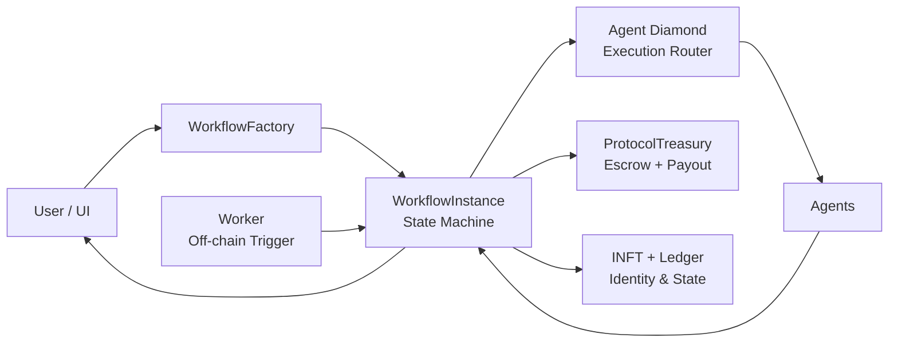

# 🧠 0G Workflow Protocol – Contracts

Smart contract system for programmable agent workflows with on-chain execution, modular routing, and automated off-chain execution.

---

## Overview

This repository contains the core contract layer for a workflow execution protocol built around agents.

### Core capabilities

* Register and manage agents
* Compose multi-step workflows
* Execute workflows on-chain
* Route payments via protocol treasury
* Track user state (NFT + ledger)
* Modular execution via Diamond architecture
* Hybrid execution using off-chain workers

---

## Architecture Overview

The protocol is composed of five orthogonal layers that together form a deterministic on-chain state machine. A **User** initiates a workflow through `WorkflowFactory`, which deploys a `WorkflowInstance` — the central state machine that coordinates all execution. An off-chain **Worker** monitors and triggers each step. Execution is routed through the **Agent Diamond**, a modular dispatch contract that delegates to individual agent facets. After each step completes, the `WorkflowInstance` settles payment via `ProtocolTreasury` and records state changes to the `INFT + Ledger` identity layer. Results are surfaced back to the user.



### Layer Breakdown

| Layer | Contracts | Role |
|-------|-----------|------|
| **Execution** | `WorkflowFactory`, `WorkflowInstance` | Entry point and per-workflow state machine |
| **Routing** | `AgentDiamond` | Dispatches execution via `delegatecall` to agent facets |
| **Registry** | `AgentRegistry`, `WorkflowRegistry` | Stores registered agents and workflow definitions |
| **Economics** | `ProtocolTreasury` | Escrow and per-step payment release |
| **Identity** | `INFT`, `UserStateLedger` | On-chain user identity and state tracking |

### Key Design Decisions

**Factories are the entry point.** `WorkflowFactory` creates `WorkflowInstance` contracts and is wired directly to `ProtocolTreasury`. `AgentFactory` builds Diamond-based agent contracts.

**Payment is gated by execution success.** `ProtocolTreasury` only releases funds after a step completes successfully — no upfront payout.

**The Worker is off-chain.** It monitors workflow state and re-triggers `WorkflowInstance` for each pending step. Without it, workflows stall.

**All data is stored as raw bytes on-chain.** No encryption, no IPFS/0G pointer layer (yet). Each step asserts input/output types before advancing state.

---

## Tech Stack

* Solidity (>=0.8.20)
* Foundry (Forge, Cast, Anvil)
* Diamond Standard (EIP-2535, modular contract routing)
* 0G EVM Testnet

---

## Project Structure

```
contracts/
├── Agent*                # Agent execution + registry + diamond
├── Workflow*             # Workflow creation + execution
├── ProtocolTreasury.sol  # Payment routing
├── UserState*            # User NFT + ledger tracking
├── interfaces/           # All system interfaces
```

---

## Setup

### Install Foundry

```bash
curl -L https://foundry.paradigm.xyz | bash
foundryup
```

### Build Contracts

```bash
forge build
```

### Run Tests

```bash
forge test
```

---

## ⚠️ Required Pre-Step (Wallet Bootstrap)

Before interacting with contracts, generate and fund wallets:

```bash
node script/1_bootstrap_wallets.js
```

**Requirements:** A funded private key.

**What it does:** Creates multiple wallets, funds them automatically, and prepares accounts for protocol interaction.

> If skipped → all transactions will fail due to insufficient funds.

---

## Deployment & Execution Flow

**Order is strict. Do not change the sequence.**

### 1. Deploy Full System

```bash
forge script script/DeployFull.s.sol:DeployFull \
  --rpc-url https://evmrpc-testnet.0g.ai/ \
  --broadcast --legacy --via-ir -vvvv
```

### 2. Create Agents

```bash
forge script script/CreateAgents.s.sol:CreateAgentsInline \
  --rpc-url https://evmrpc-testnet.0g.ai/ \
  --broadcast --via-ir --with-gas-price 3000000000 --legacy -vvvv
```

### 3. Set Workflow Factory

```bash
forge script script/SetWorkflowFactory.s.sol \
  --rpc-url https://evmrpc-testnet.0g.ai/ \
  --broadcast --via-ir --with-gas-price 3000000000 --legacy -vvvv
```

### 4. Create Workflows

```bash
forge script script/CreateWorkflows.s.sol \
  --rpc-url https://evmrpc-testnet.0g.ai/ \
  --broadcast --via-ir --with-gas-price 3000000000 --legacy -vvvv
```

### 5. Start Workflow Execution

```bash
forge script script/StartWorkflow.s.sol:StartWorkflow \
  --rpc-url https://evmrpc-testnet.0g.ai/ \
  --broadcast --legacy --via-ir -vvvv
```

---

## Off-chain Worker (Required)

After starting a workflow, run the worker:

```bash
node script/worker.js
```

**Responsibilities:**
* Monitors workflow state on-chain
* Detects pending steps and calls the appropriate agent
* Advances `WorkflowInstance` after each step completes

> Without the worker → workflows will stall after the first trigger.

---

## Minimal End-to-End Flow

```
1. Bootstrap wallets       →  fund accounts
2. Deploy contracts        →  establish on-chain system
3. Register agents         →  populate AgentRegistry
4. Create workflows        →  define step graphs
5. Start workflow          →  initialize WorkflowInstance
6. Run worker              →  drive off-chain execution loop
7. Observe execution       →  monitor state progression
```

---

## Common Issues

| Symptom | Cause | Fix |
|---------|-------|-----|
| Transactions failing | Wallets not funded | Run bootstrap script |
| Workflow not progressing | Worker not running | Run `worker.js` |
| Deployment errors | Incorrect script order | Follow exact sequence |
| RPC issues | Wrong endpoint | Verify RPC URL |

---

## Compiler Flags Reference

| Flag | Reason |
|------|--------|
| `--via-ir` | Optimized Yul-based compilation for complex contracts |
| `--legacy` | Required for 0G EVM testnet compatibility |
| `--with-gas-price 3000000000` | Fixed gas price for testnet stability |

---

## What This Enables

* Composable on-chain workflows with programmable step graphs
* Pay-per-step agent execution with escrow-backed guarantees
* Modular contract architecture via the Diamond standard
* Hybrid automation combining on-chain state and off-chain compute
* Scalable agent pipelines without centralized coordination

---

## Commands Reference

```bash
forge build        # compile contracts
forge test         # run test suite
forge fmt          # format Solidity
forge snapshot     # gas snapshots
anvil              # local EVM node
cast <subcommand>  # on-chain interactions
```

---

## Documentation

* Foundry Book: [https://book.getfoundry.sh/](https://book.getfoundry.sh/)
* EIP-2535 Diamond Standard: [https://eips.ethereum.org/EIPS/eip-2535](https://eips.ethereum.org/EIPS/eip-2535)

---

## License

MIT
